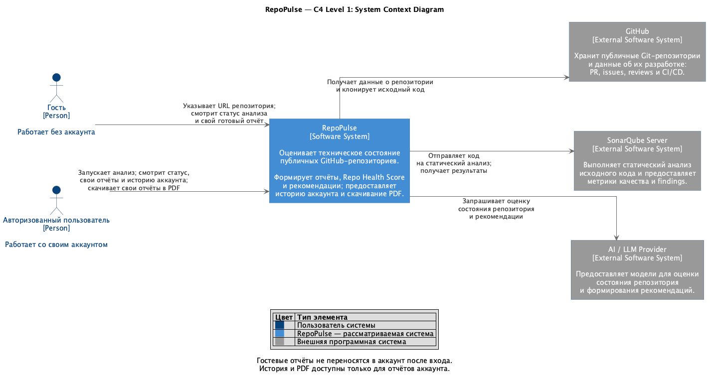

# Архитектура RepoPulse

# Назначение системы

**RepoPulse** — распределённая система для автоматизированной оценки технического состояния публичного GitHub-репозитория.

Пользователь указывает URL публичного GitHub-репозитория. Система:

1. проверяет, существует ли уже актуальный отчёт;
2. при необходимости собирает данные из GitHub API;
3. клонирует Git-репозиторий в изолированную sandbox-среду;
4. выполняет технический анализ репозитория;
5. рассчитывает Repo Health Score;
6. формирует рекомендации;
7. создаёт и сохраняет итоговый отчёт;
8. предоставляет авторизованному пользователю историю его отчётов и скачивание PDF.

## Режимы доступа

| Действие | Гость | Авторизованный пользователь |
|---|---|---|
| Запустить анализ публичного репозитория по URL | Да | Да |
| Читать статус своего анализа | Да | Да |
| Смотреть свой готовый отчёт | Да, в рамках гостевой сессии | Да |
| Читать историю своих отчётов, включая историю по репозиторию | Нет | Да |
| Скачать свой отчёт в PDF | Нет | Да |

Гость работает без регистрации аккаунта. Для доступа к своему анализу и отчёту он получает гостевую сессию. Гостевые отчёты сохраняются на сервере для получения результата, но история гостю не предоставляется.

Вход или регистрация не меняют владельца гостевых анализов и отчётов: они не переносятся в аккаунт, не включаются в его историю и не становятся доступны для скачивания PDF. Анализы, запущенные после входа, принадлежат авторизованному пользователю.

Основной pipeline анализа:

```text
PREPARING
    ↓
COLLECTING
    ↓
ANALYZING
    ↓
SCORING
    ↓
RECOMMENDING
    ↓
REPORTING
    ↓
COMPLETED
```

При критической ошибке анализ переходит в состояние:

```text
FAILED
```

# Общая архитектура

## Контекстная диаграмма — C4 Level 1

Диаграмма показывает RepoPulse как единую систему, две роли пользователей и взаимодействие с GitHub, SonarQube Server и AI/LLM Provider. Внутренние сервисы, Kafka, базы данных, кэш и инфраструктура наблюдаемости раскрываются на уровне контейнеров.



[Исходник PlantUML](diagrams/context.puml).

## Диаграмма контейнеров — C4 Level 2

Основные сервисы RepoPulse:

- API Service / BFF;
- Auth Service;
- Analysis Orchestrator;
- GitHub API Service;
- Repository Sandbox Service;
- Analysis Service;
- Scoring Service;
- Recommendation Service;
- Report Service.

Инфраструктурные компоненты:

- Kafka;
- PostgreSQL;
- Redis;
- SonarQube Server;
- AI/LLM Provider;
- Elasticsearch;
- Logstash;
- Kibana;
- Prometheus;
- Grafana.

Общая схема:

```text
Frontend
   │
   │ HTTP/JSON
   ▼
API Service / BFF
   │
   ├── gRPC → Auth Service
   ├── gRPC → Analysis Orchestrator
   └── gRPC → Report Service

Analysis Orchestrator
   │
   ├── gRPC → GitHub API Service
   ├── gRPC → Report Service
   │
   └── Kafka
        │
        ├── GitHub API Service
        ├── Repository Sandbox Service
        ├── Analysis Service
        ├── Scoring Service
        ├── Recommendation Service
        └── Report Service

Repository Sandbox Service
   │
   └── gVisor sandbox
          ├── git clone
          ├── local repository
          ├── RepoPulse analyzers
          └── SonarScanner
                 │
                 ▼
            SonarQube Server

Scoring Service ────────→ AI/LLM Provider
Recommendation Service ─→ AI/LLM Provider
```

Диаграмма контейнеров C4 Level 2: [PNG](diagrams/RepoPulse_C4_Level2.png), [PlantUML](diagrams/architecture.puml).

Хранение и инфраструктура для MVP:

```text
1 PostgreSQL container
├── auth_db
├── orchestrator_db
├── github_db
├── analysis_db
├── scoring_db
├── recommendation_db
└── report_db

1 Redis
1 Kafka
1 SonarQube Server

1 Elasticsearch
1 Logstash
1 Kibana

1 Prometheus
1 Grafana
```

Каждый сервис имеет собственную database, собственного DB user и не читает таблицы других сервисов напрямую.

Redis используется как cache, а не как source of truth.

Kafka используется как transport для тяжёлых асинхронных операций и не является source of truth для состояния анализа.

---

# 1. API Service / BFF

## Ответственность

API Service является единой точкой входа frontend в backend RepoPulse.

Он:

- предоставляет внешний HTTP API;
- выполняет базовую валидацию входных данных;
- проверяет access JWT пользователя или подписанную cookie гостевой сессии;
- формирует проверенный контекст `Requester`: `user_id` либо `guest_session_id`;
- разрешает историю и PDF только авторизованному пользователю;
- преобразует внешние DTO во внутренние gRPC-запросы;
- маршрутизирует команды и запросы во внутренние сервисы;
- выполняет error mapping;
- добавляет `request_id`;
- не содержит бизнес-логику анализа;
- не работает напрямую с PostgreSQL;
- не является владельцем доменных данных.

## Связи

```text
Frontend → HTTP → API Service

API Service → gRPC → Auth Service
API Service → gRPC → Analysis Orchestrator
API Service → gRPC → Report Service
```

## Контекст инициатора и проверка доступа

Общий внутренний контекст для запуска анализа, чтения статуса, чтения отчёта и поиска reusable report:

```protobuf
message Requester {
  oneof identity {
    string user_id = 1;
    string guest_session_id = 2;
  }
}
```

API Service получает идентификаторы только из проверенных credentials и передаёт `Requester` по доверенному внутреннему gRPC-вызову. Frontend не может назначить владельца через JSON-поля `user_id` или `guest_session_id`.

При наличии `Authorization: Bearer ...` используется пользовательский access JWT. Некорректный или истёкший access JWT приводит к `401`, а не к переключению запроса в гостевой режим. Без access JWT для гостевых операций проверяется cookie `repopulse_guest`.

Для истории и PDF обязательно наличие действующего пользовательского access JWT: одной гостевой cookie недостаточно. Проверка владельца конкретного анализа выполняется в Orchestrator, а конкретного отчёта — в Report Service. Чужой ресурс возвращает `404`, включая запросы с известным `analysis_id` или `report_id`.

## OpenAPI-контракты

### POST `/api/v1/auth/guest-session`

Создаёт гостевую сессию без логина и пароля. Frontend вызывает маршрут перед первым гостевым анализом, если действующей гостевой cookie ещё нет.

API Service вызывает `AuthService.CreateGuestSession()` и устанавливает cookie `repopulse_guest` с атрибутами `HttpOnly`, `Secure`, `SameSite=Lax`, `Path=/api/v1`. Токен не возвращается в JSON. Срок cookie совпадает со сроком гостевого токена.

Response:

```json
{
  "expires_at": "2026-10-02T10:00:00Z"
}
```

Значение времени приведено как пример; срок гостевой сессии задаётся конфигурацией. Для запросов, изменяющих состояние и использующих cookie, API применяет CSRF-защиту с проверкой Origin.

### POST `/api/v1/auth/register`

Request:

```json
{
  "login": "user",
  "password": "password"
}
```

Response:

```json
{
  "user_id": "uuid"
}
```

### POST `/api/v1/auth/login`

Request:

```json
{
  "login": "user",
  "password": "password"
}
```

Response:

```json
{
  "access_token": "...",
  "refresh_token": "..."
}
```

### POST `/api/v1/auth/refresh`

Request:

```json
{
  "refresh_token": "..."
}
```

Response:

```json
{
  "access_token": "...",
  "refresh_token": "..."
}
```

### POST `/api/v1/analyses`

Доступен гостю с действующей гостевой cookie и авторизованному пользователю с access JWT. Создаёт новый анализ или возвращает существующий актуальный Report того же владельца.

API Service добавляет проверенный `Requester` к внутреннему `StartAnalysisRequest`. Тело запроса содержит только URL репозитория.

Request:

```json
{
  "repository_url": "https://github.com/example/project"
}
```

Response при создании анализа:

```json
{
  "status": "created",
  "analysis_id": "A123"
}
```

Response при наличии актуального отчёта:

```json
{
  "status": "report_exists",
  "report_id": "R123"
}
```

### GET `/api/v1/analyses/{analysis_id}`

Доступен обоим режимам. Orchestrator сверяет `Requester` с владельцем `AnalysisRun` перед выдачей статуса, включая ответ из Redis.

Response:

```json
{
  "analysis_id": "A123",
  "status": "running",
  "current_stage": "ANALYZING",
  "stages": [
    {
      "name": "PREPARING",
      "status": "completed"
    },
    {
      "name": "COLLECTING",
      "status": "completed"
    },
    {
      "name": "ANALYZING",
      "status": "running"
    },
    {
      "name": "SCORING",
      "status": "pending"
    },
    {
      "name": "RECOMMENDING",
      "status": "pending"
    },
    {
      "name": "REPORTING",
      "status": "pending"
    }
  ]
}
```

Процент прогресса возвращается только там, где backend действительно может его подтвердить.

### GET `/api/v1/reports/{report_id}`

Возвращает отчёт, принадлежащий текущему `Requester`. Для гостя проверяется совпадение `guest_session_id`, для пользователя — `user_id`. Гостевой доступ действует до истечения гостевой сессии.

### GET `/api/v1/reports/{report_id}/pdf`

Доступен только авторизованному пользователю. API Service вызывает `ReportService.GetReportPdf(user_id, report_id)`.

Report Service проверяет владельца и формирует PDF из сохранённого immutable Report по запросу. API Service передаёт полученный поток в HTTP-ответ:

```http
Content-Type: application/pdf
Content-Disposition: attachment; filename="repopulse-report-R123.pdf"
Cache-Control: private, no-store
```

Гостевой запрос получает `401` с кодом `login_required`. Авторизованный запрос к чужому или гостевому отчёту получает `404`.

### GET `/api/v1/reports`

Доступен только с пользовательским access JWT. Возвращает историю отчётов текущего `user_id`; гостевые отчёты в неё не включаются.

Возможные query-параметры:

```text
limit
offset
repository
```

### GET `/api/v1/repositories/{owner}/{name}/reports`

Доступен только с пользовательским access JWT. Возвращает историю отчётов текущего `user_id` для конкретного repository. Оба маршрута истории возвращают гостю `401` с кодом `login_required`.

---

# 2. Auth Service

## Ответственность

Auth Service отвечает за идентификацию пользователей.

Для MVP используется авторизация по логину и паролю.

Auth Service:

- регистрирует пользователей;
- хранит пользователей;
- хранит password hash;
- проверяет логин и пароль;
- выдаёт Access Token;
- выдаёт Refresh Token;
- обновляет Access Token;
- завершает пользовательские сессии;
- создаёт гостевые сессии и выдаёт подписанный гостевой токен для cookie без создания пользователя.

API Service проверяет JWT на каждом защищённом запросе.

Проверка доступа к конкретному ресурсу выполняется доменным сервисом-владельцем ресурса.

```text
API Service:
"Кто инициатор: пользователь или гостевая сессия?"

Analysis Orchestrator:
"Принадлежит ли analysis_id этому инициатору?"

Report Service:
"Принадлежит ли report_id этому инициатору и доступна ли ему запрошенная операция?"
```

## Гостевая сессия

`CreateGuestSession` создаёт случайный `guest_session_id` и сохраняет сессию в `auth_db`. Auth Service подписывает отдельный гостевой JWT с `principal_type=guest`, `sub=guest_session_id`, `iss`, `aud` и `exp`. API Service проверяет подпись, назначение, тип и срок токена локально. Пользовательский access JWT имеет `principal_type=user`; гостевой токен не принимается как пользовательский.

Гостевой токен передаётся через `HttpOnly` cookie. Для гостя не создаются запись в `users` и refresh-сессия. По истечении сессии старые анализы и отчёты перестают быть доступны гостю; новая сессия имеет другой идентификатор. Длительность задаётся конфигурацией и должна позволять завершить анализ и просмотреть результат.

Гостевая сессия не преобразуется в пользовательскую при входе или регистрации. Auth Service не переносит гостевые отчёты и не меняет их владельца.

## gRPC-контракт

```protobuf
service AuthService {
  rpc CreateGuestSession(CreateGuestSessionRequest)
      returns (CreateGuestSessionResponse);

  rpc Register(RegisterRequest)
      returns (RegisterResponse);

  rpc Login(LoginRequest)
      returns (LoginResponse);

  rpc Refresh(RefreshRequest)
      returns (RefreshResponse);
}
```

Логически:

```text
CreateGuestSessionResponse {
    guest_token
    expires_at
}

Register {
    login
    password
}

Login {
    login
    password
}

Refresh {
    refresh_token
}
```

## Хранилище

Database:

```text
auth_db
```

Таблица `users`:

```text
users
├── id
├── login
├── password_hash
├── created_at
└── updated_at
```

Таблица `refresh_sessions`:

```text
refresh_sessions
├── id
├── user_id
├── token_hash
├── expires_at
├── revoked_at
└── created_at
```

Таблица `guest_sessions`:

```text
guest_sessions
├── id
├── expires_at
└── created_at
```

Source of truth для данных сессий — `auth_db`; Redis для выдачи и локальной проверки гостевого JWT не требуется. Истечение гостевого доступа проверяется по `exp` подписанного токена.

---

# 3. Analysis Orchestrator

## Ответственность

Analysis Orchestrator является владельцем workflow анализа.

Он:

- создаёт `AnalysisRun` с владельцем — пользователем или гостевой сессией;
- хранит текущее состояние анализа;
- хранит текущий stage;
- инициирует следующие этапы;
- ставит тяжёлые задачи через Kafka;
- принимает события о завершении этапов;
- отслеживает progress;
- обрабатывает retry;
- обрабатывает timeout;
- хранит ошибки;
- обеспечивает idempotency;
- выполняет preflight-проверку;
- решает, нужен ли новый анализ;
- предоставляет статус анализа API Service после проверки владельца;
- передаёт сохранённого владельца в команду `GenerateReport`.

## Состояния анализа

Основной pipeline:

```text
PREPARING
    ↓
COLLECTING
    ↓
ANALYZING
    ↓
SCORING
    ↓
RECOMMENDING
    ↓
REPORTING
    ↓
COMPLETED
```

Внешний статус:

```text
QUEUED
RUNNING
COMPLETED
FAILED
```

## PREPARING

На этапе `PREPARING` Orchestrator выполняет синхронные gRPC-вызовы:

```text
Orchestrator
   ├── gRPC → GitHub API Service
   │          ResolveRepositoryState()
   │
   └── gRPC → Report Service
              FindReusableReport(requester, repository, updated_at)
```

Для MVP актуальность определяется через:

```text
GET /repos/{owner}/{repo}
→ repository.updated_at
```

Если `updated_at` совпадает со значением в последнем отчёте того же владельца, новый анализ не запускается. `FindReusableReport` получает проверенный `Requester`; поиск не выдаёт отчёты других пользователей или других гостевых сессий.

## gRPC-контракт

```protobuf
service AnalysisOrchestrator {
  rpc StartAnalysis(StartAnalysisRequest)
      returns (StartAnalysisResponse);

  rpc GetAnalysisStatus(GetAnalysisStatusRequest)
      returns (GetAnalysisStatusResponse);
}
```

Логический запрос:

```text
StartAnalysis {
    requester
    repository_url
}

GetAnalysisStatus {
    requester
    analysis_id
}
```

`Requester` содержит ровно одну идентичность. Orchestrator сохраняет её при создании анализа и проверяет при чтении статуса. Наличие одного `analysis_id` не предоставляет доступ.

Результат:

```text
AnalysisCreated {
    analysis_id
}

или

ExistingReport {
    report_id
}
```

## Kafka-команды

Orchestrator является producer команд:

```text
CollectGitHubData
PrepareRepository
AnalyzeRepository
CalculateScore
GenerateRecommendations
GenerateReport
```

Kafka используется как control plane: через неё передаются команды, события и идентификаторы результатов, но не полные доменные данные.

Основной принцип:

```text
Kafka:
analysis_id
snapshot_id
result_id
```

Сами данные сервисы получают у сервиса-владельца через gRPC.

Kafka key:

```text
analysis_id
```

Общий envelope:

```json
{
  "message_id": "uuid",
  "analysis_id": "uuid",
  "type": "AnalyzeRepository",
  "created_at": "2026-09-30T10:00:00Z",
  "payload": {}
}
```

## Kafka events

Orchestrator является основным consumer событий:

```text
GitHubDataCollectionStarted
GitHubDataCollected
GitHubDataCollectionFailed

RepositoryPreparationStarted
RepositoryPrepared
RepositoryPreparationFailed

AnalysisStarted
AnalysisCompleted
AnalysisFailed

ScoringStarted
ScoringCompleted
ScoringFailed

RecommendationsStarted
RecommendationsGenerated
RecommendationsFailed

ReportGenerationStarted
ReportGenerated
ReportGenerationFailed
```

Возможны progress events:

```text
GitHubDataCollectionProgress
RepositoryPreparationProgress
AnalysisProgress
```

## Kafka topics

Command topics:

```text
repopulse.github.commands
repopulse.sandbox.commands
repopulse.analysis.commands
repopulse.scoring.commands
repopulse.recommendation.commands
repopulse.report.commands
```

Общий events topic для MVP:

```text
repopulse.analysis.events
```

Retry topics:

```text
repopulse.<service>.commands.retry
```

DLQ:

```text
repopulse.<service>.commands.dlq
```

## Хранилище

Database:

```text
orchestrator_db
```

Таблица `analysis_runs`:

```text
analysis_runs
├── id
├── user_id (nullable)
├── guest_session_id (nullable)
├── repository_owner
├── repository_name
├── repository_url
├── status
├── current_stage
├── github_snapshot_id
├── analysis_snapshot_id
├── scoring_result_id
├── recommendation_result_id
├── report_id
├── created_at
├── started_at
├── completed_at
├── error_code
└── error_message
```

Ограничение таблицы: заполнено ровно одно поле владельца — `user_id` или `guest_session_id`. Идентификаторы относятся к данным Auth Service логически; межсервисные SQL-запросы и foreign keys в чужую database не используются. Владелец анализа фиксируется при создании и не меняется после входа гостя в аккаунт.

Таблица `analysis_steps`:

```text
analysis_steps
├── id
├── analysis_id
├── stage
├── status
├── attempt
├── progress_current
├── progress_total
├── started_at
├── completed_at
├── error_code
└── error_message
```

Таблица `outbox`:

```text
outbox
├── id
├── message_id
├── aggregate_id
├── topic
├── message_type
├── payload
├── created_at
└── published_at
```

Таблица `inbox`:

```text
inbox
├── message_id
├── processed_at
└── message_type
```

`Outbox` обеспечивает надёжную отправку Kafka-команд.

`Inbox` обеспечивает идемпотентную обработку повторно доставленных Kafka events.

## Redis

Orchestrator использует Redis для кэширования часто запрашиваемого состояния анализа:

```text
analysis:{requester_type}:{requester_id}:{analysis_id}:status
```

`requester_type` равен `user` или `guest`; `requester_id` берётся из проверенного контекста. Запись содержит идентификатор владельца и состояние анализа. Orchestrator сверяет владельца до возврата как кэшированного, так и сохранённого в database статуса. Кэш разных владельцев изолирован.

Source of truth остаётся в `orchestrator_db`.

---

# 4. GitHub API Service

## Ответственность

GitHub API Service отвечает только за platform-specific данные GitHub.

Он:

- обращается к GitHub REST API;
- получает repository metadata;
- получает Pull Requests;
- получает Reviews;
- получает Issues;
- получает Comments;
- получает Workflows;
- получает Workflow Runs;
- получает Jobs;
- получает Checks;
- обрабатывает pagination;
- обрабатывает GitHub rate limits;
- выполняет retry временных HTTP-ошибок;
- нормализует GitHub DTO во внутренние модели RepoPulse;
- отслеживает completeness каждого набора данных;
- создаёт `GitHubDataSnapshot`.

## GitHubDataSnapshot

`GitHubDataSnapshot` — нормализованный снимок platform-specific данных GitHub.

Логическая структура:

```text
GitHubDataSnapshot
├── Repository
├── PullRequests
├── Reviews
├── Issues
├── Comments
├── Workflows
├── WorkflowRuns
├── Jobs
├── Checks
├── CollectionMetadata
└── CollectedAt
```

Пример repository metadata:

```text
Repository
├── Owner
├── Name
├── DefaultBranch
├── UpdatedAt
└── PushedAt
```

Для каждого набора данных хранится состояние сбора:

```text
CollectionState
├── Status
├── IsComplete
├── PagesFetched
├── ItemsFetched
└── Errors
```

Важно различать:

```text
items = []
is_complete = true
→ данных действительно нет
```

и:

```text
items = []
is_complete = false
→ отсутствие данных не подтверждено
```

Остальные сервисы не должны зависеть от GitHub-specific DTO.

## gRPC-контракт

Используется на стадии `PREPARING` и для чтения сохранённого snapshot.

```protobuf
service GitHubAPIService {
  rpc ResolveRepositoryState(ResolveRepositoryStateRequest)
      returns (ResolveRepositoryStateResponse);

  rpc GetGitHubDataSnapshot(GetGitHubDataSnapshotRequest)
      returns (GitHubDataSnapshot);
}
```

`ResolveRepositoryState` логически возвращает:

```text
owner
repository
updated_at
```

`GetGitHubDataSnapshot` принимает:

```text
github_snapshot_id
```

и возвращает сохранённый `GitHubDataSnapshot` сервису, которому он нужен.

## Kafka-контракт

Команда:

```text
CollectGitHubData
```

Пример:

```json
{
  "message_id": "uuid",
  "analysis_id": "A123",
  "type": "CollectGitHubData",
  "payload": {
    "owner": "example",
    "repository": "project"
  }
}
```

Событие:

```text
GitHubDataCollected
```

Пример:

```json
{
  "analysis_id": "A123",
  "type": "GitHubDataCollected",
  "payload": {
    "github_snapshot_id": "GS123"
  }
}
```

## Хранилище

Database:

```text
github_db
```

Таблица `repositories`:

```text
repositories
├── id
├── owner
├── name
├── canonical_url
├── default_branch
├── updated_at
├── pushed_at
└── created_at
```

Таблица `github_snapshots`:

```text
github_snapshots
├── id
├── analysis_id
├── repository_id
├── collected_at
└── status
```

Нормализованные сущности:

```text
pull_requests
reviews
issues
comments
workflows
workflow_runs
jobs
checks
```

Каждая сущность связана с `github_snapshot_id`.

Таблица `collection_states`:

```text
collection_states
├── id
├── github_snapshot_id
├── resource_type
├── collection_status
├── is_complete
├── pages_fetched
├── items_fetched
└── collected_at
```

Таблица `collection_errors`:

```text
collection_errors
├── id
├── collection_state_id
├── provider
├── resource
├── endpoint
├── http_status
├── error_code
└── message
```

---

# 5. Repository Sandbox Service

## Ответственность

Repository Sandbox Service отвечает за безопасное получение и временное размещение Git-репозитория.

Он:

- получает задачу от Orchestrator через Kafka;
- создаёт sandbox;
- клонирует Git-репозиторий непосредственно внутрь sandbox;
- ограничивает ресурсы;
- ограничивает сеть;
- запускает процессы от non-root;
- предоставляет локальный checkout для анализа;
- уничтожает sandbox после завершения анализа.

Исходный код репозитория не хранится постоянно и не передаётся целиком между сервисами.

## Изоляция

Используется:

```text
Docker/containerd
      ↓
gVisor (runsc)
      ↓
isolated sandbox
```

Ограничения:

```text
CPU limit
RAM limit
disk limit
PID limit
non-root
drop capabilities
read-only root filesystem
hard timeout
restricted network
```

## Network policy

Во время `COLLECTING`:

```text
Sandbox → GitHub
```

После clone:

```text
Internet access → denied
Sandbox → SonarQube Server → allowed
```

## Локальное хранилище

Репозиторий хранится только временно:

```text
/workspace/repository
```

После завершения анализа sandbox уничтожается.

## Kafka-контракт

Команда:

```text
PrepareRepository
```

Пример:

```json
{
  "message_id": "uuid",
  "analysis_id": "A123",
  "type": "PrepareRepository",
  "payload": {
    "owner": "example",
    "repository": "project"
  }
}
```

Событие:

```text
RepositoryPrepared
```

Пример:

```json
{
  "analysis_id": "A123",
  "type": "RepositoryPrepared",
  "payload": {
    "sandbox_id": "S123"
  }
}
```

Repository Sandbox Service не имеет постоянной собственной database.

---

# 6. Analysis Service

## Ответственность

Analysis Service выполняет технический анализ уже собранных данных.

Он получает:

```text
local Git repository
+
GitHubDataSnapshot
```

и формирует:

```text
AnalysisSnapshot
```

Analysis Service:

- анализирует структуру репозитория;
- анализирует документацию;
- анализирует тесты;
- анализирует CI/CD;
- анализирует историю и технические характеристики;
- запускает собственные RepoPulse analyzers;
- запускает SonarScanner внутри sandbox;
- получает результаты SonarQube;
- формирует metrics;
- формирует findings;
- формирует observations;
- формирует evidence;
- отслеживает completeness анализа.

Он не рассчитывает Repo Health Score.

## SonarQube

Сам SonarQube Server является отдельным постоянным инфраструктурным компонентом.

В sandbox запускается только:

```text
SonarScanner
```

Схема:

```text
Sandbox
├── repository
├── RepoPulse analyzers
└── SonarScanner
       │
       ▼
  SonarQube Server
```

## AnalysisSnapshot

`AnalysisSnapshot` — нормализованный набор технических фактов о репозитории.

```text
AnalysisSnapshot
├── Metrics
├── Findings
├── Observations
├── Completeness
└── CreatedAt
```

`Metric` — измеримый показатель:

```json
{
  "name": "ci_success_rate",
  "value": 0.82,
  "category": "ci_cd",
  "source": "github"
}
```

`Finding` — конкретная обнаруженная проблема:

```json
{
  "category": "security",
  "severity": "high",
  "source": "sonarqube",
  "message": "Potential vulnerability",
  "file": "internal/auth.go",
  "line": 42
}
```

`Observation` — факт или характеристика, которая сама по себе не обязательно является проблемой.

## gRPC-контракт

Analysis Service предоставляет read-метод для получения сохранённого snapshot:

```protobuf
service AnalysisService {
  rpc GetAnalysisSnapshot(GetAnalysisSnapshotRequest)
      returns (AnalysisSnapshot);
}
```

Запрос содержит:

```text
analysis_snapshot_id
```

## Kafka-контракт

Команда:

```text
AnalyzeRepository
```

Пример:

```json
{
  "analysis_id": "A123",
  "type": "AnalyzeRepository",
  "payload": {
    "sandbox_id": "S123",
    "github_snapshot_id": "GS123"
  }
}
```

После получения команды Analysis Service запрашивает `GitHubDataSnapshot` у GitHub API Service через gRPC по `github_snapshot_id`.

Событие:

```text
AnalysisCompleted
```

Пример:

```json
{
  "analysis_id": "A123",
  "type": "AnalysisCompleted",
  "payload": {
    "analysis_snapshot_id": "AS123"
  }
}
```

Полный `AnalysisSnapshot` через Kafka не передаётся.

## Хранилище

Database:

```text
analysis_db
```

Таблица `analysis_snapshots`:

```text
analysis_snapshots
├── id
├── analysis_id
├── repository_revision
├── completeness
└── created_at
```

Таблица `metrics`:

```text
metrics
├── id
├── analysis_snapshot_id
├── category
├── name
├── numeric_value
├── text_value
└── source
```

Таблица `findings`:

```text
findings
├── id
├── analysis_snapshot_id
├── category
├── severity
├── source
├── message
├── file_path
└── line
```

Таблица `observations`:

```text
observations
├── id
├── analysis_snapshot_id
├── category
├── source
└── description
```

---

# 7. Scoring Service

## Ответственность

Scoring Service рассчитывает оценку состояния репозитория.

Он получает:

```text
AnalysisSnapshot
```

и формирует:

```text
ScoringResult
```

Он:

- рассчитывает score по категориям;
- рассчитывает общий Repo Health Score;
- формирует объяснение оценки;
- использует AI/LLM Provider;
- хранит model/prompt/schema versions.

Он не ходит в GitHub, не читает repository и не запускает SonarQube.

## ScoringResult

```text
ScoringResult
├── OverallScore
├── CategoryScores
├── Explanation
├── ModelVersion
├── PromptVersion
├── SchemaVersion
└── CreatedAt
```

Пример:

```json
{
  "overall_score": 74,
  "category_scores": [
    {
      "category": "documentation",
      "score": 90,
      "explanation": "..."
    },
    {
      "category": "ci_cd",
      "score": 62,
      "explanation": "..."
    }
  ]
}
```

## gRPC-контракт

Scoring Service предоставляет read-метод:

```protobuf
service ScoringService {
  rpc GetScoringResult(GetScoringResultRequest)
      returns (ScoringResult);
}
```

Запрос содержит:

```text
scoring_result_id
```

## Kafka-контракт

Команда:

```text
CalculateScore
```

Пример:

```json
{
  "analysis_id": "A123",
  "type": "CalculateScore",
  "payload": {
    "analysis_snapshot_id": "AS123"
  }
}
```

После получения команды Scoring Service вызывает:

```text
Analysis Service.GetAnalysisSnapshot(analysis_snapshot_id)
```

по gRPC, получает полный `AnalysisSnapshot` и выполняет расчёт.

Событие:

```text
ScoringCompleted
```

Пример:

```json
{
  "analysis_id": "A123",
  "type": "ScoringCompleted",
  "payload": {
    "scoring_result_id": "SC123"
  }
}
```

Полный `ScoringResult` через Kafka не передаётся.

## Хранилище

Database:

```text
scoring_db
```

Таблица `scoring_results`:

```text
scoring_results
├── id
├── analysis_id
├── analysis_snapshot_id
├── overall_score
├── explanation
├── model_version
├── prompt_version
├── schema_version
└── created_at
```

Таблица `category_scores`:

```text
category_scores
├── id
├── scoring_result_id
├── category
├── score
└── explanation
```

---

# 8. Recommendation Service

## Ответственность

Recommendation Service формирует рекомендации по улучшению репозитория.

Он получает:

```text
AnalysisSnapshot
+
ScoringResult
```

и формирует:

```text
RecommendationResult
```

Рекомендации содержат:

- priority;
- action;
- expected effect;
- complexity;
- связь с конкретными findings.

Для генерации используется AI/LLM Provider.

## RecommendationResult

```text
RecommendationResult
├── Recommendations
├── ModelVersion
├── PromptVersion
├── SchemaVersion
└── CreatedAt
```

Пример рекомендации:

```json
{
  "priority": "high",
  "action": "Добавить обязательный запуск тестов в CI для pull request",
  "expected_effect": "Снизит вероятность попадания непроверенных изменений в основную ветку",
  "complexity": "small",
  "related_finding_ids": [
    "finding-42"
  ]
}
```

## gRPC-контракт

Recommendation Service предоставляет read-метод:

```protobuf
service RecommendationService {
  rpc GetRecommendationResult(GetRecommendationResultRequest)
      returns (RecommendationResult);
}
```

Запрос содержит:

```text
recommendation_result_id
```

## Kafka-контракт

Команда:

```text
GenerateRecommendations
```

Пример:

```json
{
  "analysis_id": "A123",
  "type": "GenerateRecommendations",
  "payload": {
    "analysis_snapshot_id": "AS123",
    "scoring_result_id": "SC123"
  }
}
```

После получения команды Recommendation Service синхронно получает необходимые данные:

```text
gRPC → Analysis Service.GetAnalysisSnapshot(analysis_snapshot_id)
gRPC → Scoring Service.GetScoringResult(scoring_result_id)
```

Событие:

```text
RecommendationsGenerated
```

Пример:

```json
{
  "analysis_id": "A123",
  "type": "RecommendationsGenerated",
  "payload": {
    "recommendation_result_id": "REC123"
  }
}
```

Полный `RecommendationResult` через Kafka не передаётся.

## Хранилище

Database:

```text
recommendation_db
```

Таблица `recommendation_results`:

```text
recommendation_results
├── id
├── analysis_id
├── analysis_snapshot_id
├── scoring_result_id
├── model_version
├── prompt_version
├── schema_version
└── created_at
```

Таблица `recommendations`:

```text
recommendations
├── id
├── recommendation_result_id
├── priority
├── action
├── expected_effect
└── complexity
```

Таблица `recommendation_findings`:

```text
recommendation_findings
├── recommendation_id
└── finding_id
```

---

# 9. Report Service

## Ответственность

Report Service является владельцем итоговых отчётов пользователей и гостевых сессий.

Он:

- формирует итоговый Report;
- сохраняет отчёт;
- предоставляет готовые отчёты;
- предоставляет авторизованному пользователю историю его отчётов;
- предоставляет авторизованному пользователю его историю по конкретному репозиторию;
- проверяет владельца отчёта для пользователя и гостевой сессии;
- формирует PDF по запросу авторизованного владельца отчёта;
- ищет reusable report в рамках того же владельца;
- хранит `repository.updated_at`;
- создаёт новый immutable Report на каждый новый анализ.

Он не рассчитывает score и не генерирует рекомендации.

## Report

Итоговая модель:

```text
Report
├── ID
├── AnalysisID
├── UserID (nullable)
├── GuestSessionID (nullable)
├── Repository
├── RepositoryUpdatedAt
├── OverallScore
├── CategoryScores
├── Findings
├── Recommendations
├── Completeness
├── GeneratedAt
└── SchemaVersion
```

Отчёт является immutable:

```text
новый анализ → новый Report
старый Report → не изменяется
```

Отчёт принадлежит ровно одному владельцу: пользователю или гостевой сессии. Владелец фиксируется при создании; вход и регистрация гостя его не меняют. Гостевой отчёт не включается в историю аккаунта и не предоставляется этому аккаунту для скачивания PDF.

## gRPC-контракт

```protobuf
service ReportService {
  rpc GetReport(GetReportRequest)
      returns (GetReportResponse);

  rpc GetReportPdf(GetReportPdfRequest)
      returns (stream ReportPdfChunk);

  rpc GetUserReports(GetUserReportsRequest)
      returns (GetUserReportsResponse);

  rpc GetRepositoryReports(GetRepositoryReportsRequest)
      returns (GetRepositoryReportsResponse);

  rpc FindReusableReport(FindReusableReportRequest)
      returns (FindReusableReportResponse);
}
```

При генерации отчёта Report Service получает полные данные не через Kafka, а через gRPC у сервисов-владельцев:

```text
gRPC → GitHub API Service.GetGitHubDataSnapshot(github_snapshot_id)
gRPC → Analysis Service.GetAnalysisSnapshot(analysis_snapshot_id)
gRPC → Scoring Service.GetScoringResult(scoring_result_id)
gRPC → Recommendation Service.GetRecommendationResult(recommendation_result_id)
```

`GetReport` принимает:

```text
requester
report_id
```

и проверяет совпадение владельца с `Requester`. Проверка обязательна при ответе как из PostgreSQL, так и из Redis.

`GetReportPdf` принимает `user_id` из проверенного пользовательского контекста и `report_id`. Report Service проверяет, что отчёт принадлежит этому `user_id`, затем формирует PDF из сохранённых данных и возвращает поток `ReportPdfChunk { bytes data }`. Отчёт гостевой сессии не проходит эту проверку. PDF создаётся по запросу; дополнительный анализ репозитория не запускается.

`GetUserReports` принимает `user_id` и параметры пагинации и возвращает только отчёты этого пользователя. Гостевой контекст не допускается.

`GetRepositoryReports` принимает `user_id`, repository и параметры пагинации и возвращает историю этого пользователя для конкретного репозитория. Гостевой контекст не допускается. Report Service повторно проверяет тип инициатора для истории и PDF, даже если ограничение уже применено в API Service.

`FindReusableReport` принимает:

```text
requester
repository
repository_updated_at
```

и возвращает подходящий `report_id`, если такой отчёт уже существует у того же владельца. Пользовательский отчёт ищется по `user_id`, гостевой — по `guest_session_id`. Новый пользовательский анализ не переиспользует гостевой отчёт.

## Kafka-контракт

Команда:

```text
GenerateReport
```

Пример:

```json
{
  "analysis_id": "A123",
  "type": "GenerateReport",
  "payload": {
    "requester": {
      "user_id": "U123"
    },
    "github_snapshot_id": "GS123",
    "analysis_snapshot_id": "AS123",
    "scoring_result_id": "SC123",
    "recommendation_result_id": "REC123"
  }
}
```

Для гостевого анализа поле `requester` содержит `{"guest_session_id": "G123"}` вместо `user_id`. Orchestrator копирует владельца из сохранённого `AnalysisRun` в команду и сохраняет её в outbox. Credentials, JWT, cookie и refresh-токены через Kafka не передаются.

Команда содержит идентификатор владельца и только идентификаторы результатов предыдущих этапов. После её получения Report Service забирает полные данные через gRPC у соответствующих сервисов и сохраняет владельца в `reports`. Отсутствующий или неоднозначный владелец приводит к отклонению команды, а не к созданию публичного отчёта.

После формирования и сохранения отчёта Report Service публикует:

```text
ReportGenerated {
    analysis_id,
    report_id
}
```

Пример:

```json
{
  "analysis_id": "A123",
  "type": "ReportGenerated",
  "payload": {
    "report_id": "R123"
  }
}
```

Analysis Orchestrator получает событие и переводит анализ:

```text
REPORTING → COMPLETED
```

Также Orchestrator сохраняет:

```text
analysis_run.report_id = R123
```

## Получение готового отчёта

Генерация отчёта выполняется асинхронно через Kafka, а чтение уже сформированного отчёта — синхронно через gRPC.

Frontend гостя или авторизованного пользователя узнаёт о завершении своего анализа через polling с соответствующими credentials:

```text
GET /api/v1/analyses/{analysis_id}
```

После завершения API возвращает:

```json
{
  "analysis_id": "A123",
  "status": "completed",
  "report_id": "R123"
}
```

После этого frontend получает свой отчёт отдельным запросом. Гость предъявляет гостевую cookie, пользователь — access JWT; API передаёт проверенный `Requester` в Report Service:

```text
Frontend
    ↓ HTTP
GET /api/v1/reports/{report_id}
    ↓
API Service
    ↓ gRPC
Report Service
    ↓
Redis / report_db
    ↓
Report
```

Analysis Orchestrator в чтении готового отчёта не участвует.

Прошлые отчёты доступны только авторизованному пользователю и читаются по схеме:

```text
Frontend
    ↓ HTTP
GET /api/v1/reports
    ↓
API Service
    ↓ gRPC
Report Service
    ↓
история отчётов текущего пользователя
```

История по конкретному репозиторию также требует пользовательского access JWT:

```text
GET /api/v1/repositories/{owner}/{name}/reports
```

## Скачивание PDF

```text
Авторизованный пользователь
    ↓ access JWT
GET /api/v1/reports/{report_id}/pdf
    ↓
API Service: проверка пользовательского JWT
    ↓ gRPC GetReportPdf(user_id, report_id)
Report Service: проверка владельца отчёта
    ↓
сохранённый Report → формирование PDF
    ↓ gRPC stream
API Service → HTTP application/pdf → браузер
```

Источником PDF является готовый immutable Report. Report Service читает его из cache или `report_db` с проверкой доступа. Для MVP PDF формируется по запросу и не требует нового сервиса или отдельного постоянного файлового хранилища.

Вход пользователя с существующим гостевым отчётом не предоставляет право скачать этот отчёт. Чтобы получить отчёт в истории аккаунта и PDF, пользователь запускает анализ в авторизованном режиме; reusable report может быть найден только среди отчётов его аккаунта.

Таким образом:

```text
Analysis Orchestrator → отвечает за состояние и завершение анализа.
Report Service        → отвечает за доступ к отчётам, историю аккаунта и PDF.
```

## Хранилище

Database:

```text
report_db
```

Таблица `reports`:

```text
reports
├── id
├── analysis_id
├── user_id (nullable)
├── guest_session_id (nullable)
├── repository_owner
├── repository_name
├── repository_url
├── repository_updated_at
├── overall_score
├── scoring_result_id
├── recommendation_result_id
├── generated_at
└── schema_version
```

Для `reports` действует ограничение:

```sql
CHECK ((user_id IS NOT NULL) <> (guest_session_id IS NOT NULL))
```

Заполнено ровно одно поле владельца. Оно соответствует владельцу `AnalysisRun`, полученному из команды `GenerateReport`. Для истории используется фильтр `user_id = current_user_id`; гостевые записи не попадают в результат.

Для быстрого чтения итогового отчёта допускается денормализация:

```text
report_category_scores
report_findings
report_recommendations
```

## Redis

Report Service использует Redis по cache-aside схеме.

Кэш отчёта:

```text
report:user:{user_id}:{report_id}
report:guest:{guest_session_id}:{report_id}
```

Тип и идентификатор владельца берутся из проверенного `Requester`. Кэш содержит владельца вместе с данными отчёта; Report Service сверяет его перед выдачей. Попадание в кэш не отменяет проверку доступа. PDF доступен только через пользовательский контекст и только для пользовательского отчёта.

Кэш списка отчётов пользователя:

```text
reports:{user_id}:list
```

При создании нового пользовательского отчёта список пользователя инвалидируется:

```text
DEL reports:{user_id}:list
```

Для гостевого отчёта кэш истории не создаётся. Любая конфигурация TTL кэша не продлевает срок гостевой сессии.

Source of truth остаётся в `report_db`.

---

# Передача данных между сервисами

Для межсервисного взаимодействия используется reference-based модель.

Kafka передаёт:

```text
analysis_id
snapshot_id
result_id
requester (идентификатор владельца в GenerateReport)
```

Полные доменные объекты и credentials через Kafka не передаются. Идентификатор владельца в `GenerateReport` берётся из `AnalysisRun` и нужен Report Service для сохранения принадлежности отчёта.

Сервис, которому нужны данные предыдущего этапа, получает их через gRPC у сервиса-владельца.

Схема:

```text
Analysis Service
    ↓
analysis_db
    ↓
Kafka:
AnalysisCompleted {
    analysis_id,
    analysis_snapshot_id
}
    ↓
Analysis Orchestrator
    ↓
Kafka:
CalculateScore {
    analysis_id,
    analysis_snapshot_id
}
    ↓
Scoring Service
    ↓ gRPC
Analysis Service.GetAnalysisSnapshot(...)
```

Далее:

```text
Scoring Service
    ↓
scoring_db
    ↓
Kafka:
ScoringCompleted {
    analysis_id,
    scoring_result_id
}
    ↓
Analysis Orchestrator
    ↓
Kafka:
GenerateRecommendations {
    analysis_id,
    analysis_snapshot_id,
    scoring_result_id
}
    ↓
Recommendation Service
    ├── gRPC → Analysis Service.GetAnalysisSnapshot(...)
    └── gRPC → Scoring Service.GetScoringResult(...)
```

Для формирования отчёта:

```text
Report Service
    ├── gRPC → GitHub API Service.GetGitHubDataSnapshot(...)
    ├── gRPC → Analysis Service.GetAnalysisSnapshot(...)
    ├── gRPC → Scoring Service.GetScoringResult(...)
    └── gRPC → Recommendation Service.GetRecommendationResult(...)
```

Таким образом:

- Kafka отвечает за запуск этапов и доставку событий;
- PostgreSQL хранит результат каждого сервиса;
- gRPC используется для синхронного чтения сохранённых результатов;
- сервисы не читают databases друг друга напрямую;
- Analysis Orchestrator не маппит и не пересылает полные доменные данные, а управляет только workflow и идентификаторами результатов.


# Observability

## Логи

Используется ELK Stack:

```text
Services
   ↓
structured JSON logs
   ↓
Logstash
   ↓
Elasticsearch
   ↓
Kibana
```

Рекомендуемые поля:

```text
timestamp
level
service
analysis_id
request_id
stage
message
error
```

`analysis_id` является основным correlation identifier для workflow анализа.

Пример:

```json
{
  "timestamp": "2026-09-30T10:00:00Z",
  "level": "error",
  "service": "scoring-service",
  "analysis_id": "A123",
  "stage": "SCORING",
  "message": "LLM request failed"
}
```

## Метрики

Используется:

```text
Prometheus
    ↓
Grafana
```

Основной подход:

```text
RED:
Rate
Errors
Duration
```

Примеры:

```text
http_requests_total
http_request_errors_total
http_request_duration_seconds

analyses_started_total
analyses_completed_total
analyses_failed_total
analysis_duration_seconds

kafka_consumer_lag
kafka_messages_processed_total
kafka_messages_failed_total

sandbox_active
sandbox_creation_duration_seconds
sandbox_failures_total

github_requests_total
github_request_errors_total
github_rate_limit_remaining

llm_requests_total
llm_request_errors_total
llm_request_duration_seconds
```

---

# MVP Deployment

Для MVP каждый сервис запускается в одном экземпляре:

```text
1x API Service
1x Auth Service
1x Analysis Orchestrator
1x GitHub API Service
1x Repository Sandbox Service
1x Analysis Service
1x Scoring Service
1x Recommendation Service
1x Report Service
```

Инфраструктура:

```text
1x PostgreSQL container
1x Redis
1x Kafka
1x SonarQube Server

1x Elasticsearch
1x Logstash
1x Kibana

1x Prometheus
1x Grafana
```

Repository Sandbox Service работает в одном экземпляре, но создаёт временный gVisor sandbox на конкретный анализ.

---

# Итоговый flow анализа

Перед запуском frontend использует пользовательский access JWT либо получает гостевую cookie через `POST /api/v1/auth/guest-session`. API Service формирует `Requester` из проверенных credentials.

```text
Гость или авторизованный пользователь
 ↓
Frontend
 ↓ HTTP + guest cookie / access JWT
API Service
 ↓ gRPC StartAnalysis(requester, repository_url)
Analysis Orchestrator

PREPARING
 ├── GitHub API Service:
 │      GET repository.updated_at
 │
 └── Report Service:
        FindReusableReport(requester, repository, updated_at)

если report актуален и принадлежит тому же владельцу
        ↓
return existing Report

иначе

COLLECTING
 ├── Kafka → GitHub API Service
 │            CollectGitHubData
 │
 └── Kafka → Repository Sandbox Service
              PrepareRepository
              ↓
              gVisor
              ↓
              git clone

оба завершены
        ↓

ANALYZING
        ↓
Analysis Service
 ├── local repository
 ├── gRPC → GitHub API Service.GetGitHubDataSnapshot(...)
 ├── RepoPulse analyzers
 └── SonarScanner → SonarQube
        ↓
AnalysisSnapshot → analysis_db
        ↓
Kafka: AnalysisCompleted(analysis_snapshot_id)

SCORING
        ↓
Scoring Service
 ├── gRPC → Analysis Service.GetAnalysisSnapshot(...)
 └── AI/LLM
        ↓
ScoringResult → scoring_db
        ↓
Kafka: ScoringCompleted(scoring_result_id)

RECOMMENDING
        ↓
Recommendation Service
 ├── gRPC → Analysis Service.GetAnalysisSnapshot(...)
 ├── gRPC → Scoring Service.GetScoringResult(...)
 └── AI/LLM
        ↓
RecommendationResult → recommendation_db
        ↓
Kafka: RecommendationsGenerated(recommendation_result_id)

REPORTING
        ↓
Kafka: GenerateReport(requester, snapshot/result IDs)
        ↓
Report Service
 ├── gRPC → GitHub API Service.GetGitHubDataSnapshot(...)
 ├── gRPC → Analysis Service.GetAnalysisSnapshot(...)
 ├── gRPC → Scoring Service.GetScoringResult(...)
 └── gRPC → Recommendation Service.GetRecommendationResult(...)
        ↓
immutable Report + user_id / guest_session_id → report_db
        ↓
Kafka: ReportGenerated(report_id)
        ↓
Analysis Orchestrator
        ↓
REPORTING → COMPLETED

Frontend polling:
GET /api/v1/analyses/{analysis_id} + credentials
        ↓
Orchestrator: проверка владельца AnalysisRun
        ↓
{
  status: completed,
  report_id: ...
}

Просмотр своего отчёта гостем или пользователем:

Frontend
   ↓ GET /api/v1/reports/{report_id} + credentials
API Service
   ↓ gRPC GetReport(requester, report_id)
Report Service: проверка владельца
   ↓
Redis / report_db
   ↓
Report

Только авторизованный пользователь:
GET /api/v1/reports → история аккаунта
GET /api/v1/repositories/{owner}/{name}/reports → история аккаунта по repository
GET /api/v1/reports/{report_id}/pdf → PDF своего пользовательского отчёта
```

Гостевые отчёты сохраняют своего первоначального владельца. Вход или регистрация не добавляют их в историю аккаунта и не предоставляют доступ к их PDF.
